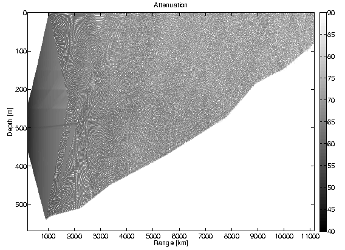
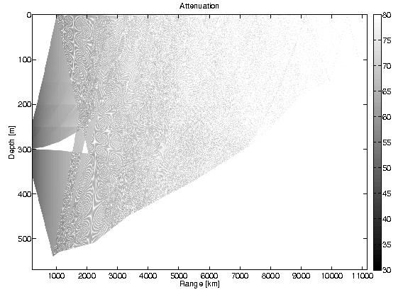
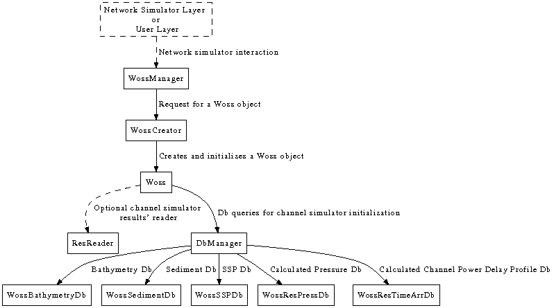

# World Ocean Simulation System (WOSS)

***Author: Federico Guerra - `WOSS@guerra-tlc.com`***

***Version: 2.0.1***

This document provides a short techical description of the *World Ocean Simulation System* (WOSS) library 
and of its optional integration into _Multi InteRfAce Cross Layer Extension_ (NS-Miracle) and _ns-3_.
 
## Library overview
 
The WOSS library aims to model a channel power delay or frequency attenuation profiles 
according to a more accurate representation of propagation phenomena as described by the laws of acoustical physics [3]. 

WOSS is a *multi-threaded* framework that permits the integration of any existing underwater channel simulator that expects environmental data as input 
and provides as output a channel realization represented using the channel profiles just mentioned.
 
Currently WOSS integrates the Bellhop ray-tracing program or any of its equivalent forks [4], while the NS-Miracle integration library retains the previously mentioned formula for the noise power. 
 
Bellhop calculations are performed across the whole bandwidth with custom resolution, 
while noise calculations are performed at the geometric average of the highest and the lowest frequencies of the band being used, as pointed in [5]. 

To calculate the solution of the propagation equations between a transmitter and a receiver, Bellhop requires the knowledge of the _Sound Speed Profile (SSP)_ which is the propagation speed of sound considered as a function of water depth. 
Different profiles lead to potentially very different propagation effects, including surface sound channels, deep sound channels, convergence zones, shadow zones, and so on, (see [3]), the _Bathymetric Profile (BP)_ and the type of _Bottom Sediments (BS)_, required to model acoustic power losses due to bottom reflections.

In this respect, WOSS offers a technology independent database API and a number of classes to manipulate SSP, BP and BS data. 
 
For the SSP, it employs a custom implementation of the World Ocean Database [7]-[12], a collection of SSPs calculated with the `TEOS-10` [6] exact formula based on the depth, temperature and salinity data measured during a number of experiments around the world; 
the measurements are divided by location and day or season of the year when the measurement was performed (recall that sound propagation is affected by water temperature, which in turn undergoes seasonal changes, especially in the superficial layer).
 
The bathymetry data have been taken from the General Bathymetric Chart of the Oceans [12], a public database offering samples of the depth of the sea bottom with an angular spacing of 30 seconds of arc. 
 
Finally, the type of bottom sediments is provided by a geo-acoustic analysis of the 
National Geophysical Data Center's Deck41 data-base [13].
 
Thanks to this automation the user only has to specify the location in the world and the time where the simulation should take place. This is done by setting the simulated date and the wanted latitude and longitude of every node involved. The simulator automatically handles the rest. 
 
In more detail, the simulator picks the location (i.e., latitude, longitude and depth) of the transmitter and the receiver and queries the database manager for samples of bottom sediments, measured SSPs (for simplicity, the SSP can also be assumed to be constant, on average, throughout the network area) and for bathymetry data along the path. 
 Full customization of surficial sediment, bathymetry and SSP data is also possible if more accurate data is available. 
 
The power delay profile obtained with Bellhop can be used to model multiple receptions: in detail the user can choose to coherently combine the complex channel gains with a custom resolution time window and obtain one or more complex channel taps.
 
From version **1.3.0** WOSS supports time evolution for a better representation of the channel variability.

From version **1.3.5** the simplified acoustic model based on empirical equations for the 
calculation of delay, attenuation and noise power has been moved into _NS-Miracle_.
These equations can be found in [1], [2].
 
From version **2.0.0** WOSS has been refactored to modern C++ and support for C++17 is now mandatory.
Furthermore it supports *command line execution* in order to generate channel simulation results that can be further analyzed via scripting automation.
See the Command Line section.

From version **2.0.1** WOSS supports the ability to customize the Bellhop executable name, thus enabling the user to plug other Bellhop variants, such as `bellhopcxx` and `bellhopcuda`.
See woss::BellhopCreator class.

Figs. 1.1 and 1.2 show the coherent sum of all channel taps, obtained with WOSS for an  example scenario. 

**Fig. 1.1** represents the attenuation incurred by an acoustic wave at 4 kHz transmitted in August, approximately 20 km offshore the harbor of the city of Taranto, Southern Italy, with the transmitter located at 40.32N, 17.12E, 300 m depth. 
Darker shades of gray represent stronger signal power. 
The figure shows that the signal reaches the top right corner surface, about 11 km from the transmitter, bearing sufficient power to allow correct reception. 

In contrast, **Fig. 1.2** shows the same scenario in March: in this case, the average temperature of the water is lower, changing the way the sound is refracted and reflected by the sea bottom. Here, any acoustic receiver deployed between 9 and 11 km from the transmitter may be unable to acquire the transmitted signal. Furthermore, a shadow zone of about 2 km appears in front of 
the transmitter, causing failure in a hypothetical short range communication scenario.

## Technical Overview
 
In this section, a short techical overview of the WOSS library and its _API_ is provided.

### The Foundation Classes
 
WOSS foundation is a complete set of classes for:
- _geographical coordinates_ (woss::Coord , woss::CoordZ): measured in decimal degrees, this classes offers methods for distance, bearing, and marsden square calculations and other mathematical formulas;
- _date time_ (woss::Time): date time arithmetics;
- _simulation time reference_ (woss::TimeReference): importing a simulation time reference from the external network simulator;
- _random number generation_ (woss::RandomGenerator): importing a custom random generator from an external network simulator or library;
- _sound speed profile_ (woss::SSP): sound speed calculations and manipulations with equations taken from the scientific literature;
- _surficial sediment_ (woss::Sediment): geoacoustic sediment parameter definitions and manipulations;
- _channel power delay profile_ (woss::TimeArr): profile sampling, averaging etc.
- _pressure_ (woss::Pressure): arithmetic and conversion operators;
- _transducer_ (woss::Transducer): accurate power consumption calculations and beam pattern capabilities of real transducers;
- _altimetry_ (woss::Altimetry): a base class that should be used for implementing and simulating different sea surface wave spectra.
- a _definitions handler_ class for "plugging-in" at run-time any class that inherits from the ones described above (woss::DefHandler). 
- _test suite_ (woss::WossTest): a base class that should be used for writing tests of specific WOSS framework APIs. 

### The Database APIs

The woss::WossDb API separates database technology implementation (SQL, NetCDF, textual…) 
from data type implementation, permitting maximum code modularity and re-usability.

Data types are defined with woss::WossBathymetryDb, woss::WossSedimentDb, woss::WossSSPDb.
 
The woss::WossDbCreator API provides interface for creation and initializiation of WossDb objects, providing the user a ready-made database instance.

Custom defined bathymetry, SSP and sediment databases are accessed through the woss::WossDbManager API, to provide a further refinement of data (eg. averaging, arithmetics…).
 
The woss::WossResPressDb and woss::WossResTimeArrDb classes provide the possibility to store and retrieve channel simulation results in any user defined fashion.
 
### The Channel Simulator APIs

 The woss::Woss API has the task of integrating a channel simulator. It gives interface for:
- setting up the enviroment from databases or from custom data;
- configuring, running and reading results of any channel simulator;
- averaging and giving output results over any number of runs and frequencies;
- optionally reading channel simulator's results (woss::ResReader, woss::WossResReader).

The woss::WossCreator API provides interface for creation and initializiation of woss::Woss objects, relieving the user from this task.

The woss::WossManager API has the logic to control and manipulate and create woss::Woss objects. 
 It offers the abilities to:
- carefully create and utilize Woss objects to minimize CPU load;
- plan a strategy for time-varying and/or multi-frequency channel simulations;
- use on-the-fly custom bathymetry, sediment or SSP data for any tx-rx pair.

Finally the woss::WossController API has the task of inter-connecting all major APIs involved.

### WOSS block diagram

### Current capabilities

The current version provides:
- interface implementation for the Bellhop ray tracing program [4], (woss::BellhopWoss, woss::BellhopCreator);
- interface implementation and custom NetCDF db of monthly averaged SSPs, 
calculated with the `TEOS-10` exact formula [6] based on the temperature, salinity and depth data taken from the World Ocean Atlas database of 2001 [7], 2005 [8], 2009 [9], 2013 [10], 2018 [11] and 2023 [12] (woss::SspWoa2005Db, woss::SspWoa2005DbCreator);
- interface implementation for the GEBCO NetCDF bathymetry databases (all versions: 1D, 2D, 2008, 2014, 2019, 2020, 2021, 2022, 2023, 2024, 2025) [12], (woss::BathyGebcoDb, woss::BathyGebcoDbCreator);
- interface implementation and custom NetCDF data analysis taken from the DECK41 database, for bottom sediments composition [13], (woss::SedimDeck41Db, woss::SedimDeck41DbCreator, woss::SedimDeck41CoordDb, woss::SedimDeck41MarsdenDb, woss::SedimDeck41MarsdenOneDb);
- A _multi-threaded_ version that allows the parallel execution of multiple channel simulators (woss::WossManagerResDbMT);
- a database of real acoustic transducers made from publicly avalaible datasheets;
- an implementation of the Bretschneider sea surface wave spectrum for altimetry simulations;
- support for time evolution, to account for channel variability.
- support for unit testing that are integrated with autotools.
- support for modern C++17 syntax, idioms and features, like multithread with std::async or woss::ThreadPool, smart pointers etc

See [Databases description](../woss/woss_db/README.md#databases-description) for further info on custom database, 
[Transducers](../woss/woss_def/README.md#underwater-acoustic-transducers) for further info on transducers, 
[Altimetry](../woss/woss_def/README.md#altimetry-models) for further info on altimetry models, 
[Time evolution](../woss/woss_def/README.md#time-evolution-modeling) for further info on time evolution modeling.

### ns-3 integration

WOSS has been officially integrated into ns-3's UAN (Underwater Acoustic Network) model.
for more information please refer to the official [woss-ns3 repository](https://github.com/MetalKnight/woss-ns3)

### References

 1. R. Urick, _Principles of Underwater Sound_. McGraw-Hill, 1983.
 2. M. Stojanovic, “On the relationship between capacity and distance in an underwater acoustic communication channel,” _ACM Mobile Comput. and Commun. Review_, vol. 11, no. 4, pp. 34–43, 2007.
 3. F. Jensen, W. Kuperman, M. Porter, and H. Schmidt, _Computational Ocean Acoustics_. Springer-Verlag, 2000. {#reference_3}
 4. Bellhop programs:
    - Bellhop code, http://oalib.hlsresearch.com/Rays/index.html .
    - A new Bellhop, https://github.com/A-New-BellHope/bellhop .
    - BellhopCXX and BellhopCuda, https://github.com/A-New-BellHope/bellhopcuda .
 5. P. C. Etter, _Underwater acoustic modeling and simulation_. Spon Press, Taylor & Francis group, 2003.
 6. `TEOS-10` source code http://www.TEOS-10.org .
 7. World Ocean Atlas 2001, https://www.nodc.noaa.gov/OC5/WOA01/pr_woa01.html .
 8. World Ocean Atlas 2005, https://www.nodc.noaa.gov/OC5/WOA05/pr_woa05.html .
 9. World Ocean Atlas 2009, https://www.nodc.noaa.gov/OC5/WOA09/pr_woa09.html .
 10. World Ocean Atlas 2013, https://www.nodc.noaa.gov/OC5/woa13/ .
 11. World Ocean Atlas 2018, https://www.nodc.noaa.gov/OC5/woa18/ .
 12. World Ocean Atlas 2023, https://www.nodc.noaa.gov/OC5/woa23/ .
 13. General bathymetric chart of the oceans, http://www.gebco.net .
 14. National geophysical data center, seafloor surficial sediment descriptions, http://www.ngdc.noaa.gov/mgg/geology/deck41.html .