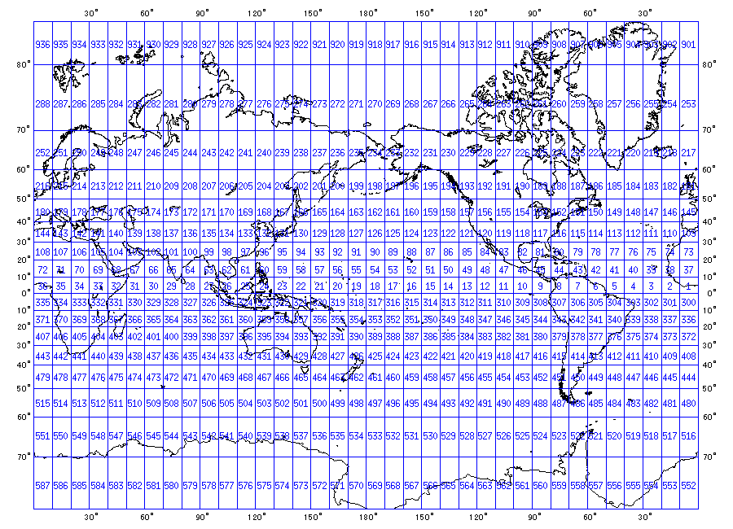
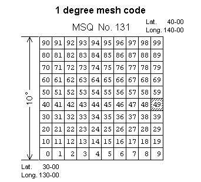

# Databases Description

 
## GEBCO bathymetric NetCDF Database
 
Please refer to official GEBCO documentation for further info on this NetCDF file.
see woss::BathyGebcoDb, woss::BathyGebcoDbCreator
 
## World Ocean Atlas 2005 and 2009 SSP Databases
 
These databases contain monthly, seasonal and annual average of sound speed profiles, calculated with the TEOS-10 exact formula, and based on the depth, temperature and salinity provided by the World Ocean Atlas.
The available resolution is 1° x 1°. Data are provided at _standard depths_: 
 
<b>0, 10m, 20m, 30m, 50m, 75m, 100m, 125m, 150m, 200m, 250m, 300m, 400m, 500m, 600m, 700m, 800m,
900m, 1000m, 1100m, 1200m, 1300m, 1400m, 1500m, 1750m, 2000m, 2500m, 3000m,
3500m, 4000m, 4500m, 5000m, 5500m</b>

The NetCDF files have been generated with NetCDF classic and are compatible with NetCDF4 library.
Each NetCDF file has the following dimensions:
- _latitude_: 180 values, from 89.5° to -89.5°
- _longitude_: 360 values, from -179.5° to 179.5° 
- _depth_: 33 values (standard depths).

Each NetCDF file has the following variables description:
- _float ssp(latitude, longitude, depth)_;  
  ssp:units = "m/s";
- _float latitude(latitude)_;  
    latitude:units = "decimal degrees";
- _float longitude(longitude)_;  
    longitude:units = "decimal degrees";
- _short depth(depth)_;  
    depth:units = "m";

see woss::SSP, woss::SspWoa2005Db, woss::SspWoa2005DbCreator

## World Ocean Atlas 2001, 2013, 2018 and 2023 SSP Databases

These databases contain monthly, seasonal and annual average of sound speed profiles, calculated with the TEOS-10 exact formula, and based on the depth, temperature and salinity provided by the World Ocean Atlas.
 
The available resolution is 0.25° x 0.25°. Data are provided at _standard depths_:

<b>0, 10m, 20m, 30m, 50m, 75m, 100m, 125m, 150m, 200m, 250m, 300m, 400m, 500m, 600m, 700m, 800m,
900m, 1000m, 1100m, 1200m, 1300m, 1400m, 1500m, 1750m, 2000m, 2500m, 3000m,
3500m, 4000m, 4500m, 5000m, 5500m</b>

The databases require NetCDF4 + HDF5 support.
Each NetCDF4 file has the following dimensions: 
- _latitude_: 720 values, from -89.875° to 89.875°
- _longitude_: 1440 values, from -179.875° to 179.875° 
- _depth_: 33 values (standard depths).

Each NetCDF4 file has the following variables description:
- _float ssp(latitude, longitude, depth)_;  
  ssp:units = "m/s";
- _float latitude(latitude)_  
  latitude:units = "decimal degrees";
- _float longitude(longitude)_;  
  longitude:units = "decimal degrees";
- _short depth(depth)_;  
  depth:units = "m" ;

see woss::SSP, woss::SspWoa2005Db, woss::SspWoa2005DbCreator

## DECK41 Sediment NetCDF Database

The DECK41 collection contains surficial sediment descriptions for over 36,000 seafloor samples worldwide.
Data include collecting source, ship, cruise, sample id, latitude/longitude, date of collection, water depth, 
sampling device, dominant lithology, secondary lithology, and a brief description of the surficial sediment at the location.

The NetCDF files provided indexes the dominant and secondary lithology for geoacoustical purposes.  
These values are represented by an unsigned integer number between 0 and 11:
0. Coarser than sand
1. Sand
2. Silt
3. Clay
4. Ooze
5. Mud
6. Rocks, Rocks fragment
7. Organic material (shell, peat, wood, coral, etc.)
8. Nodules, slab or concretions (manganese, phosphate, iron, glauconite)
9. Hard bottom 
11. NO_VALUE

These values are collected in three different databases, and they come in different database format versions.
see woss::Sediment, woss::SedimDeck41Db, woss::SedimDeck41DbCreator

## DECK41 NetCDF database

This database contains all the valid DECK41 coordinates, quantized as per data formats below.
see woss::SedimDeck41CoordDb

### V1 Data Format

This database has a NetCDF legacy format, with resolution of 0.016° x 0.016°, with a single index dimension covering:
- _latitude_: 10801 values, from 90.0° to -90.0°
- _longitude_: 21601 values, from -180° to 180.0° 
- _spacing_: 0.0166666666666667°
- _total indexes_ (xysize) 233312401

This NetCDF file has the following variables description:
- _byte seafloor_main_type(xysize)_;  
   seafloor_main_type:units = "DECK 41 type";  
   seafloor_main_type:valid_min = 0;  
   seafloor_main_type:valid_max = 9;
- _byte seafloor_secondary_type(xysize)_;  
   seafloor_secondary_type:units = "DECK 41 type";  
   seafloor_secondary_type:valid_min = 0 ;  
   seafloor_secondary_type:valid_max = 9 ;

### V2 Data Format

This database has a NetCDF4 format, with resolution of 0.016° x 0.016°, with the following dimensions:
- _latitude_: 10800 values, from -89.9833333333333333° to 89.9833333333333333°
- _longitude_: 21600 values, from -179.9833333333333333° to 179.9833333333333333°

The _spacing_ is 0.0166666666666667°

This NetCDF file has the following variables description:
- _byte seafloor_main_type(latitude, longitude)_;  
   seafloor_main_type:units = "DECK 41 type";  
   seafloor_main_type:valid_min = 0 ;  
   seafloor_main_type:valid_max = 9 ;
- _byte seafloor_secondary_type(latitude, longitude);  
   seafloor_secondary_type:units = "DECK 41 type";  
   seafloor_secondary_type:valid_min = 0;  
   seafloor_secondary_type:valid_max = 9;

## DECK41 marsden square NetCDF database

This database covers all marsden squares. Lithology data of a marsden square are 
a representative set of all original data for that particular square.
see woss::SedimDeck41MarsdenDb

### V1 Data Format

The database is in NetCDF legacy format. It has a single dimension:
- _marsden_square_: 937 values

This NetCDF file has the following variables description:
- _byte seafloor_main_type(marsden_square)_;  
   seafloor_main_type:units = "DECK 41 type";  
   seafloor_main_type:valid_min = 0;  
   seafloor_main_type:valid_max = 9;
- _byte seafloor_secondary_type(marsden_square)_;  
   seafloor_secondary_type:units = "DECK 41 type";  
   seafloor_secondary_type:valid_min = 0;  
   seafloor_secondary_type:valid_max = 9;

### V2 Data Format

The database is in NetCDF4 format. It has a single dimension:
- _marsden_square_: 936 values

This NetCDF file has the following variables description:
- _byte seafloor_main_type(marsden_square)_;  
  seafloor_main_type:units = "DECK 41 type";  
  seafloor_main_type:valid_min = 0;  
  seafloor_main_type:valid_max = 9;
- _byte seafloor_secondary_type(marsden_square)_;  
  seafloor_secondary_type:units = "DECK 41 type";  
  seafloor_secondary_type:valid_min = 0;  
  seafloor_secondary_type:valid_max = 9; 

## DECK41 marsden coordinates NetCDF database

This database covers all marsden coordinates squares (marsden square, marsden one degree square).
Lithology data of a marsden coordinates square are a representative set of all original data 
for that particular set of marsden coordinates.

See woss::SedimDeck41MarsdenOneDb

### V1 Data Format

The database is in NetCDF legacy data format. It has two dimensions:
- _marsden_square_: 937 values
- _marsden_one_degree_: 100 values

The database has the following variables description:
- _byte seafloor_main_type(marsden_square, marsden_one_degree)_;  
   seafloor_main_type:units = "DECK 41 type";  
   seafloor_main_type:valid_min = 0;  
   seafloor_main_type:valid_max = 9;
- _byte seafloor_secondary_type(marsden_square, marsden_one_degree)_;  
  seafloor_secondary_type:units = "DECK 41 type";  
  seafloor_secondary_type:valid_min = 0;  
  seafloor_secondary_type:valid_max = 9;

### V2 Data Format

The database is in NetCDF4 data format. It has two dimensions:
- _marsden_square_: 936 values
- _marsden_one_degree_: 100 values

The database has the following variables description:
- _byte seafloor_main_type(marsden_square, marsden_one_degree)_;  
  seafloor_main_type:units = "DECK 41 type";  
  seafloor_main_type:valid_min = 0;  
  seafloor_main_type:valid_max = 9;
- _byte seafloor_secondary_type(marsden_square, marsden_one_degree)_;  
  seafloor_secondary_type:units = "DECK 41 type";  
  seafloor_secondary_type:valid_min = 0;  
  seafloor_secondary_type:valid_max = 9;

## DECK41 Sediment selection logic

woss::SedimDeck41Db uses all three NetCDF database for its Sediment query process:
- it first queries the woss::SedimDeck41CoordDb first with provided coordinates; 
- if a suitable result is not found, then it continues the search in woss::SedimDeck41MarsdenOneDb, e.g. in the corrispondant marsden one degree square associated with given coordinates;
- if even this step fails, it finally searches woss::SedimDeck41MarsdenDb for the marsden square associated.

See woss::SedimDeck41Db, woss::Deck41TypeTests

## DECK41 geoacoustic parameters

A thorough analysis has been done and is still in process to correctly provide geoacoustical parameters for DECK41 lithology data. 
The available categories are: 
- Coarser than sand - woss::SedimentGravel
- Sand - woss::SedimentSand
- Silt - woss::SedimentSilt
- Clay - woss::SedimentClay
- Ooze - woss::SedimentOoze
- Mud - woss::SedimentMud
- Rocks, Rocks fragment - woss::SedimentRocks
- Organic material (shell, peat, wood, coral, etc.) - woss::SedimentOrganic
- Nodules, slab or concretions (manganese, phosphate, iron, glauconite) - woss::SedimentNodules
- Hard bottom - woss::SedimentHardBottom

See woss::Sediment 

### Geoacustical references

This is a short list of references for the geoacoustical parameter analysis:
- L. D. Hampton, “Acoustic Properties of Sediments,” _J. Acoust. Soc. Am._, vol. 42, 
  pp. 882-890, year 1967. 
- E. L. Hamilton, “Sound velocity-density relations in sea-floor sediments and rocks,” 
  _J. Acoust. Soc. Am._, vol. 63, no. 2, pp. 366-377, year 1978. 
- E. L. Hamilton, “Geoacoustic modeling of the sea floor,” 
 _J. Acoust. Soc. Am._, vol. 68, no. 5, pp. 1313-1340, year 1980. 
- P. Milholland, M. H. Manghnani, S. O. Schlanger and G. H. Sutton, 
  “Geoacoustic modeling of deep-sea carbonate sediments,” _J. Acoust. Soc. Am._, 
   vol. 68, no. 5, pp. 1351-1360, year 1980.
- F. A. Bowles, “A Geoacoustic Model for Fine-Grained, Unconsolidated Calcareous 
  Sediments (ARSRP Natural Laboratory),” _Naval Research Lab Stennis Space Center MS_, 
  pp. 58, year 1994. 
- F. A. Bowles, “Observations on attenuation and shear-wave velocity in fine-grained, marine sediments,” 
 _J. Acoust. Soc. Am._, vol. 101, no. 6, pp. 3385-3397, year 1997.
- M. Siderius and  J.-P. Hermand, “Yellow Shark Spring 1995: Inversion results from sparse broadband 
  acoustic measurements over a highly range-dependent soft clay layer,” 
  _J. Acoust. Soc. Am._, vol. 106, no. 2, pp. 637-651, year 1999.

